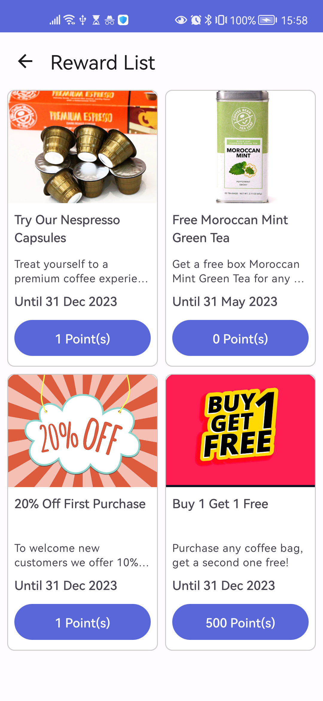
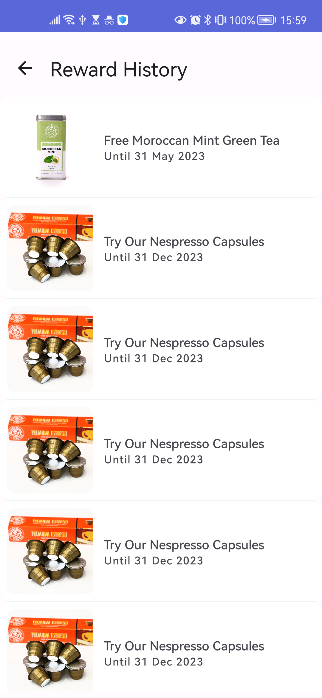

[](https://jitpack.io/#nimblehq/business-loyalty-android-sdk-poc)

# Loyalty SDK

This repository demonstrates the Loyalty SDK and sample app for demonstration.

## Usage

Clone the repository

`git clone git@github.com:nimblehq/business-loyalty-android-sdk-poc.git`

## Samples

Open `sampleapp` folder and build the project

------------

| Samples | |
|:-----|---------|
|  <br><br> Home screen that demonstrate features from SDK <br><br> • Sign-in<br>• Reward List<br>• Reward History<br><br><br> |  |
|  |  |
|  <br><br> Reward List screen that show reward information. <br><br> • Image<br>• Title & description<br>• Expiration<br>• Reward redemption<br><br><br> |  |
|  |  |
|  <br><br> Reward Details screen that show reward information. <br><br> • Image<br>• Title & description<br>• Expiration<br>• Reward redemption<br>• Terms<br><br><br> |  |
|  |  |
|  <br><br> Reward History screen that show redeemed reward information. <br><br> • Image<br>• Title<br>• Expiration<br><br><br> |  |

## Loyalty SDK

### Features

- Authenticate
- Get reward list
- Get reward details
- Redeem reward
- Get reward history

### Requirements

Android 7.+ (SDK 24.+)

### Installation

- Step 1: Add the JitPack repository
  - Add the JitPack repository to your `build.gradle(root)` file.
    ```
        allprojects {
            repositories {
                ...
                maven { url 'https://jitpack.io' }
            }
        }
    ```

  - On Gradle 6.8+, add the Jitpack repository to `settings.gradle`.
    ```
    dependencyResolutionManagement {
        repositoriesMode.set(RepositoriesMode.FAIL_ON_PROJECT_REPOS)
        repositories {
            google()
            mavenCentral()
            maven { url 'https://jitpack.io' }
        }
    }
    ```

- Step 2: Add the dependency to `build.gradle(:app)`.
    ```
        dependencies {
            implementation 'com.github.nimblehq:business-loyalty-android-sdk-poc:<version>'
        }
    ```

- Step 3: `Sync` the gradle files.

## SDK Integration

### Initialization

Open `Application` class and add `CLIENT_ID` and `CLIENT_SECRET` to init the SDK instance.

```kotlin
@HiltAndroidApp
class MyApplication : Application() {

    override fun onCreate() {
        super.onCreate()
        // TODO Add your keys
        LoyaltySdk.Builder
            .withContext(this)
            .withDebugMode(BuildConfig.DEBUG)
            .withClientId("CLIENT_ID")
            .withClientSecret("CLIENT_SECRET")
            .init()
    }
}
```

### Authentication

- To access the system, user requires sign-in with username/pass. The SDK provides a built-in screen to handle this authentication flow.

```kotlin
    LoyaltySdk.getInstance().authenticate(activity)
```

- Validate the authentication state.

```kotlin
    LoyaltySdk.getInstance().getAuthenticationState { result ->
        when (result) {
            is Result.Success -> // result.data
            is Result.Error -> // result.exception
            else -> {}
        }
    }
```

- Clear the session.

```kotlin
    LoyaltySdk.getInstance().clearSession { result ->
        when (result) {
            is Result.Success -> // result.data
            is Result.Error -> // result.exception
            else -> {}
        }
    }
```

### Get Reward list

Retrieves the list of available rewards for the authenticated user.

```kotlin
    LoyaltySdk.getInstance().redeemReward(rewardId) { result ->
        when (result) {
            is Result.Success -> // result.data
            is Result.Error -> // result.exception
            else -> {}
        }
    }
```

### Get Reward details

Retrieves the reward details for the authenticated user.

```kotlin
    LoyaltySdk.getInstance().getRewardDetail(rewardId) { result ->
        when (result) {
            is Result.Success -> // result.data
            is Result.Error -> // result.exception
            else -> {}
        }
    }
```

### Redeem a Reward

Redeems a reward with the given reward's code for the authenticated user.

```kotlin
    LoyaltySdk.getInstance().getRewardList { result ->
        when (result) {
            is Result.Success -> // result.data
            is Result.Error -> // result.exception
            else -> {}
        }
    }
```

### Get Redeemed reward list (History)

Retrieves the reward history for the authenticated user.

```kotlin
    LoyaltySdk.getInstance().getRedeemedRewardList { result ->
        when (result) {
            is Result.Success -> // result.data
            is Result.Error -> // result.exception
            else -> {}
        }
    }
```

### Exceptions

<table>
   <tr>
      <th colspan="3">LoyaltySdkException</th>
   </tr>
   <tr>
      <th>Category</th>
      <th>Exception</th>
      <th>Description</th>
   </tr>
   <tr>
      <td rowspan="4">AuthenticationException</td>
      <td>UnableToInitSignInUrl</td>
      <td>Could not create the sign in URL</td>
   </tr>
   <tr>
      <td>UnableToInitCallbackUrl</td>
      <td>Could not create the callback URL</td>
   </tr>
   <tr>
      <td>UnableToAuthenticate</td>
      <td>An error occurred when attempting to sign in</td>
   </tr>
   <tr>
      <td>UnauthenticatedException</td>
      <td>Unauthorized access. Please call LoyaltySdk.getInstance().authenticate(activity) to authenticate</td>
   </tr>
   <tr>
      <td rowspan="4">InitializationException</td>
      <td>InvalidContext</td>
      <td>Context must not be null</td>
   </tr>
   <tr>
      <td>InvalidClientId</td>
      <td>CLIENT_ID must not be null or empty</td>
   </tr>
   <tr>
      <td>InvalidClientSecret</td>
      <td>CLIENT_SECRET must not be null or empty</td>
   </tr>
   <tr>
      <td>LateInitialization</td>
      <td>LoyaltySdk has not been initialized. Initialize new instance by using LoyaltySdk.Builder</td>
   </tr>
   <td rowspan="2">NetworkException</td>
   <td>NoConnectivity</td>
   <td>No connectivity</td>
   </tr>
   <tr>
      <td>ApiResponse</td>
      <td>Error message from API response</td>
   </tr>
</table>

## License

This project is Copyright (c) 2014 and onwards Nimble. It is free software and may be redistributed under the terms specified in the [LICENSE] file.

[LICENSE]: /LICENSE

## About
<a href="https://nimblehq.co/">
  <picture>
    <source media="(prefers-color-scheme: dark)" srcset="https://assets.nimblehq.co/logo/dark/logo-dark-text-160.png">
    
  </picture>
</a>

This project is maintained and funded by Nimble.

We ❤️ open source and do our part in sharing our work with the community!
See [our other projects][community] or [hire our team][hire] to help build your product.

Want to join? [Check out our Jobs][jobs]!

[community]: https://github.com/nimblehq
[hire]: https://nimblehq.co/
[jobs]: https://jobs.nimblehq.co/
